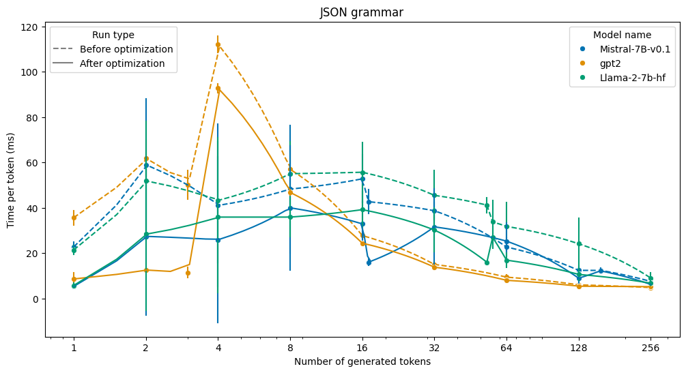

# Benchmarking constrained generation overhead in transformers-CFG

This document provides guidelines and on benchmarking grammar constrained decoding when working with the `transformers_cfg` library.

## Table of Contents

  - [Benchmarking ](#benchmarking-)
  - [Analyzing the results ](#analyzing-the-results-)


## Benchmarking <a name="benchmarking"></a>

To measure the grammar-constrined generation overtime, one can use `transformers-CFG/examples/benchmarking/benchmark_generation.sh`.

It is designed to calculate per-token logits processing latency for different grammars, with verying generation lengths and prompts.

To run the benchmarking script, you can use the following command:

```bash
 ./benchmark_generation.sh grammar_path prompts_path hg_model;

```

Where the arguments are:
- `grammar_path`: the path to the grammar file in .ebnf format. (see `examples/grammars`)
- `prompts_path`: the path to the prompts file in .txt format. (see `examples/prompts`)
- `hg_model`: the [Hugging Face Transformers](https://github.com/huggingface/transformers) model name or path to the model. (e.g. `openai-community/gpt2`)

The output of the script will be saved in `transformers_cfg/examples/benchmarking/logs` directory in a .tsv format.

The output contains the following columns:

- `prompt`:	the text of the prompt (see more on the benchmarking prompt design in the `examples/benchmarking/process_benchmarking_logs.ipynb`)
- `n_tokens`: number of tokens generated (can be affected by the `max_new_tokens` parameter)
- `run_id`: run id (each generation is performed 5 times per prompt to account for noise in the execution time measurmnet)
- `total_time`: total overhead (depends on the complexity of the grammar, the model, the prompt and the device)
- `time_per_token`: per token overhead
- `device`: device
- `model_id`: the [Hugging Face Transformers](https://github.com/huggingface/transformers) model name or path to the model
- `constrained_time`: total time of constrained generation (including forward passes)
- `unconstrained_time`: total time of constrained generation (including forward passes)

## Analyzing the results <a name="analyzing-the-results"></a>

To aggregare and visualize the results, you can use the `transformers_cfg/examples/benchmarking/process_benchmarking_logs.ipynb` notebook.

The notebook will load the logs from the `transformers_cfg/examples/benchmarking/logs` directory and provide you with the following visualization:


