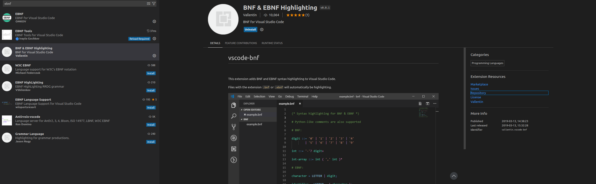
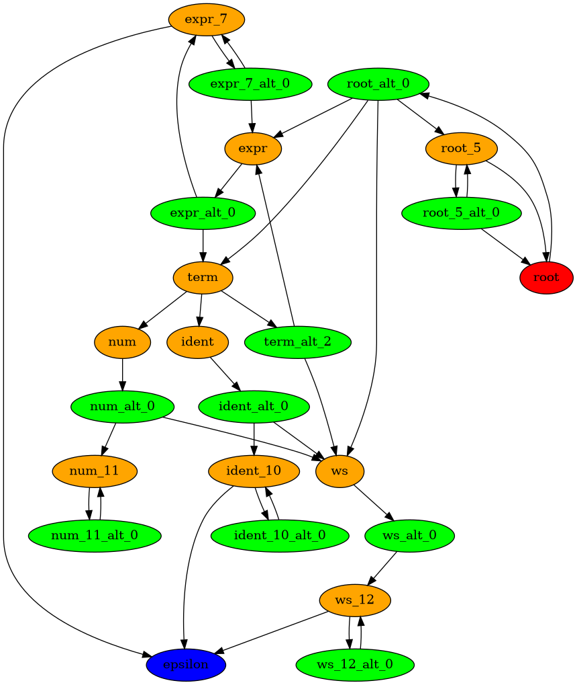

# Debugging Custom Grammars in transformers-CFG

This document provides guidelines and best practices for debugging custom grammars when working with the `transformers_cfg` library. Whether you are creating a new grammar or modifying an existing one, this guide aims to help you navigate through common pitfalls and issues.

## Table of Contents

- [Introduction](#introduction)
- [Syntax Hightlighting](#syntax-highlighting)
- [Variants of EBNF](#variants-of-ebnf)
- [Check parsing of EBNF grammar](#check-parsing-of-ebnf-grammar)
- [Test the grammar with a simple input](#test-the-grammar-with-a-simple-input)
- [DEBUG mode](#debug-mode)
- [Incremental Development and Testing](#incremental-development-and-testing)
- [Isolating Grammar Components](#isolating-grammar-components)
- [Test with language model](#test-with-language-model)

## Introduction

The syntax and semantics of context-free grammars (CFGs) can be complex, and creating or modifying grammars can be challenging. This guide aims to provide a comprehensive set of strategies and tools to help you debug custom grammars effectively.
`transformers_cfg` used EBNF notation to define grammars.
In particular, it is aligned with the grammar module of [llama-cpp](https://github.com/ggerganov/llama.cpp/tree/master/grammars).
This [doc from llama-cpp](https://github.com/ggerganov/llama.cpp/tree/master/grammars) provides a good introduction to EBNF grammars(it is called `gbnf` in llama-cpp, but for simplicity, you can consider it as `ebnf` without bothering)


## Syntax Highlighting

There is a vscode extension called `EBNF` which provides syntax highlighting for EBNF grammars.
Here is how it looks like:
<p align="center">
    
</p>
<p align="center"><em>Figure 1: EBNF Syntax Highlighting</em></p>

## Variants of EBNF

EBNF is a notation rather than a strict standard.
There exist several different variants of EBNF, each having a slightly different syntax but the same underlying semantics.

The two major variants are:
- [ISO/IEC 14977](https://en.wikipedia.org/wiki/Extended_Backus%E2%80%93Naur_form) - The original standard for EBNF
- [W3C EBNF](https://www.w3.org/TR/REC-xml/#sec-notation) - The variant used in the W3C XML specification

The EBNF variant used in `transformers_cfg` is mostly aligned with the W3C EBNF variant, but has one small difference:
- The negation operator is `^` is not yet supported in `transformers_cfg`, we will add it in the future.

## Check parsing of EBNF grammar

Suppose you have written an EBNF grammar and want to know if it is correct or not.
The first step is to check if it can be parsed by the `transformers_cfg/parser::parse_ebnf` function.
`python -m transformers_cfg.parser ----grammar-file examples/grammars/your_grammar.ebnf`

Example output for json grammar is:
```terminal
Grammar Rules:
<0>root_2 ::= <2>jp-char <4>root_2 | <8>jp-char
<12>root_4 ::= <14>jp-char <16>root_4 | <20>jp-char
<24>root_3 ::= <26>[ -  -
-
] <33>root_4
<37>root_5 ::= <39>root_3 <41>root_5 |
<47>root ::= <49>root_2 <51>root_5
<55>jp-char ::= <57>hiragana | <61>katakana | <65>punctuation | <69>cjk
<73>hiragana ::= <75>[ぁ-ゟ]
<80>katakana ::= <82>[ァ-ヿ]
<87>punctuation ::= <89>[、-〾]
<94>cjk ::= <96>[一-鿿]

Grammar Hex representation:
0002 0005 0001 0001 0001 0002 0000 0003 0001 0001 0000 0000 0004 0005 0001 0001 0001 0004 0000 0003 0001 0001 0000 0000 0003 000a 0006 0020 0020 0009 0009 000a 000a 0001 0004 0000 0000 0005 0005 0001 0003 0001 0005 0000 0001 0000 0000 0000 0005 0001 0002 0001 0005 0000 0000 0001 0003 0001 0006 0000 0003 0001 0007 0000 0003 0001 0008 0000 0003 0001 0009 0000 0000 0006 0004 0002 3041 309f 0000 0000 0007 0004 0002 30a1 30ff 0000 0000 0008 0004 0002 3001 303e 0000 0000 0009 0004 0002 4e00 9fff 0000 0000 ffff

Rules Decimal representation:
<2> [[5, 1, 1, 1, 2, 0], [3, 1, 1, 0]]
<4> [[5, 1, 1, 1, 4, 0], [3, 1, 1, 0]]
<3> [[10, 6, 32, 32, 9, 9, 10, 10, 1, 4, 0]]
<5> [[5, 1, 3, 1, 5, 0], [1, 0]]
<0> [[5, 1, 2, 1, 5, 0]]
<1> [[3, 1, 6, 0], [3, 1, 7, 0], [3, 1, 8, 0], [3, 1, 9, 0]]
<6> [[4, 2, 12353, 12447, 0]]
<7> [[4, 2, 12449, 12543, 0]]
<8> [[4, 2, 12289, 12350, 0]]
<9> [[4, 2, 19968, 40959, 0]]
symbol_ids:
{'root': 0, 'jp-char': 1, 'root_2': 2, 'root_3': 3, 'root_4': 4, 'root_5': 5, 'hiragana': 6, 'katakana': 7, 'punctuation': 8, 'cjk': 9}
```

If the grammar can be parsed, it means that it is syntactically correct. (In case you have graphviz installed, you can also generate the parse tree by adding `--graph` option)

<p align="center">
    
</p>
<p align="center"><em>Figure 2: graph visualization of the arithmetic grammar</em></p>

## Test the grammar with a simple input

After you have checked that the grammar can be parsed, you can test it with a simple input to see if it can generate the expected output.
We provide a simple script to do this:

```python
from transformers_cfg.parser import parse_ebnf
from transformers_cfg.recognizer import StringRecognizer

with open("examples/grammars/json.ebnf", "r") as file:
    input_text = file.read()
parsed_grammar = parse_ebnf(input_text)

start_rule_id = parsed_grammar.symbol_table["root"]
recognizer = StringRecognizer(parsed_grammar.grammar_encoding, start_rule_id)

# Test the grammar with a simple input
json_input = '{"foo": "bar", "baz": "bat"}'
is_accepted = recognizer._accept_prefix(json_input)
print(is_accepted)
```

If the above script returns `True`, it means that the grammar can recognize the input string.
If it returns `False`, it means that the grammar cannot recognize the input string.
In this case, you need to check in which step the input string is rejected.
N.B. the recognizer can accept partial input, so you can try the following:

```python
json_input = '{"foo": "bar"'
is_accepted = recognizer._accept_prefix(json_input)
print(is_accepted)
```

This helps you to see where the grammar fails to recognize the input string.

If you want to check if the sentence is complete or not, you can use `_accept_string` method, which returns `True` if the input string is complete and `False` otherwise.

## DEBUG mode

You can enable the DEBUG mode to see the parsing process of the input string.
```bash
export TCFG_LOG_LEVEL=DEBUG
```

The output will be like:
```terminal
DEBUG:root:code point [123] corresponding to { is accepted
DEBUG:root:code point [123, 34] corresponding to " is accepted
DEBUG:root:code point [123, 34, 102] corresponding to f is accepted
DEBUG:root:code point [123, 34, 102, 111] corresponding to o is accepted
DEBUG:root:code point [123, 34, 102, 111, 111] corresponding to o is accepted
DEBUG:root:code point [123, 34, 102, 111, 111, 34] corresponding to " is accepted
DEBUG:root:code point [123, 34, 102, 111, 111, 34, 58] corresponding to : is accepted
DEBUG:root:code point [123, 34, 102, 111, 111, 34, 58, 32] corresponding to   is accepted
DEBUG:root:code point [123, 34, 102, 111, 111, 34, 58, 32, 34] corresponding to " is accepted
DEBUG:root:code point [123, 34, 102, 111, 111, 34, 58, 32, 34, 98] corresponding to b is accepted
DEBUG:root:code point [123, 34, 102, 111, 111, 34, 58, 32, 34, 98, 97] corresponding to a is accepted
DEBUG:root:code point [123, 34, 102, 111, 111, 34, 58, 32, 34, 98, 97, 114] corresponding to r is accepted
DEBUG:root:code point [123, 34, 102, 111, 111, 34, 58, 32, 34, 98, 97, 114, 34] corresponding to " is accepted
DEBUG:root:code point [123, 34, 102, 111, 111, 34, 58, 32, 34, 98, 97, 114, 34, 44] corresponding to , is accepted
DEBUG:root:code point [123, 34, 102, 111, 111, 34, 58, 32, 34, 98, 97, 114, 34, 44, 32] corresponding to   is accepted
DEBUG:root:code point [123, 34, 102, 111, 111, 34, 58, 32, 34, 98, 97, 114, 34, 44, 32, 34] corresponding to " is accepted
DEBUG:root:code point [123, 34, 102, 111, 111, 34, 58, 32, 34, 98, 97, 114, 34, 44, 32, 34, 98] corresponding to b is accepted
DEBUG:root:code point [123, 34, 102, 111, 111, 34, 58, 32, 34, 98, 97, 114, 34, 44, 32, 34, 98, 97] corresponding to a is accepted
DEBUG:root:code point [123, 34, 102, 111, 111, 34, 58, 32, 34, 98, 97, 114, 34, 44, 32, 34, 98, 97, 122] corresponding to z is accepted
DEBUG:root:code point [123, 34, 102, 111, 111, 34, 58, 32, 34, 98, 97, 114, 34, 44, 32, 34, 98, 97, 122, 34] corresponding to " is accepted
DEBUG:root:code point [123, 34, 102, 111, 111, 34, 58, 32, 34, 98, 97, 114, 34, 44, 32, 34, 98, 97, 122, 34, 58] corresponding to : is accepted
DEBUG:root:code point [123, 34, 102, 111, 111, 34, 58, 32, 34, 98, 97, 114, 34, 44, 32, 34, 98, 97, 122, 34, 58, 32] corresponding to   is accepted
DEBUG:root:code point [123, 34, 102, 111, 111, 34, 58, 32, 34, 98, 97, 114, 34, 44, 32, 34, 98, 97, 122, 34, 58, 32, 34] corresponding to " is accepted
DEBUG:root:code point [123, 34, 102, 111, 111, 34, 58, 32, 34, 98, 97, 114, 34, 44, 32, 34, 98, 97, 122, 34, 58, 32, 34, 98] corresponding to b is accepted
DEBUG:root:code point [123, 34, 102, 111, 111, 34, 58, 32, 34, 98, 97, 114, 34, 44, 32, 34, 98, 97, 122, 34, 58, 32, 34, 98, 97] corresponding to a is accepted
DEBUG:root:code point [123, 34, 102, 111, 111, 34, 58, 32, 34, 98, 97, 114, 34, 44, 32, 34, 98, 97, 122, 34, 58, 32, 34, 98, 97, 116] corresponding to t is accepted
DEBUG:root:code point [123, 34, 102, 111, 111, 34, 58, 32, 34, 98, 97, 114, 34, 44, 32, 34, 98, 97, 122, 34, 58, 32, 34, 98, 97, 116, 34] corresponding to " is accepted
DEBUG:root:code point [123, 34, 102, 111, 111, 34, 58, 32, 34, 98, 97, 114, 34, 44, 32, 34, 98, 97, 122, 34, 58, 32, 34, 98, 97, 116, 34, 125] corresponding to } is accepted
```

This helps you to see the parsing process of the input string.

## Incremental Development and Testing

Best practices for building the grammar is start with a minimal rule and then add more rules.

## Isolating Grammar Components

When a grammar is not working as expected, it can be helpful to isolate specific components of the grammar to identify the source of the issue.
Remove or comment out parts of the grammar to see if the issue persists, and gradually reintroduce components to identify the source of the issue.

## Test with language model

Up to this point, the grammar should already be correct and the rest of the issues are not related to the grammar itself.
Testing with language model is important but it is not grammar related anymore.
